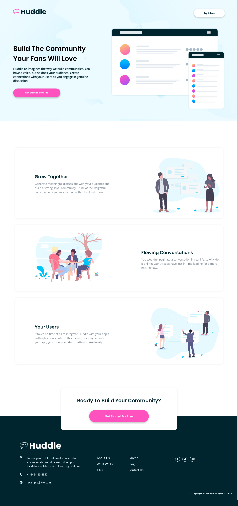

# Frontend Mentor - Huddle landing page with alternating feature blocks solution

👋 Welcome! 👋 
This is a solution to the [Huddle landing page with alternating feature blocks challenge on Frontend Mentor](https://www.frontendmentor.io/challenges/huddle-landing-page-with-alternating-feature-blocks-5ca5f5981e82137ec91a5100). Frontend Mentor challenges help you improve your coding skills by building realistic projects. 

## Table of contents

  - [Screenshot](#screenshot) 📷 
  - [Links](#links) 🔗
  - [Built with](#built-with) 🔨
  - [Author](#author) 👽

### Screenshot 📷

### Links 🔗

- Solution URL: [https://your-solution-url.com](https://your-solution-url.com)
- Repository: [https://github.com/Alan77777777/Huddle-landing-page-with-alternating-feature-blocks.git](https://github.com/Alan77777777/Huddle-landing-page-with-alternating-feature-blocks.git)
- Live Site URL: [https://your-live-site-url.com](https://your-live-site-url.com)

### Built with 🔨

- Semantic HTML5 markup
- CSS custom properties
- Flexbox
- CSS Grid
- Mobile-first workflow
- SASS

## Author 👽

- Netlify - [Alan](https://app.netlify.com/teams/alan77777777/overview)
- GitHub - [Alan77777777](https://github.com/Alan77777777)
- Frontend Mentor - [@Alan77777777](https://www.frontendmentor.io/profile/Alan77777777)

